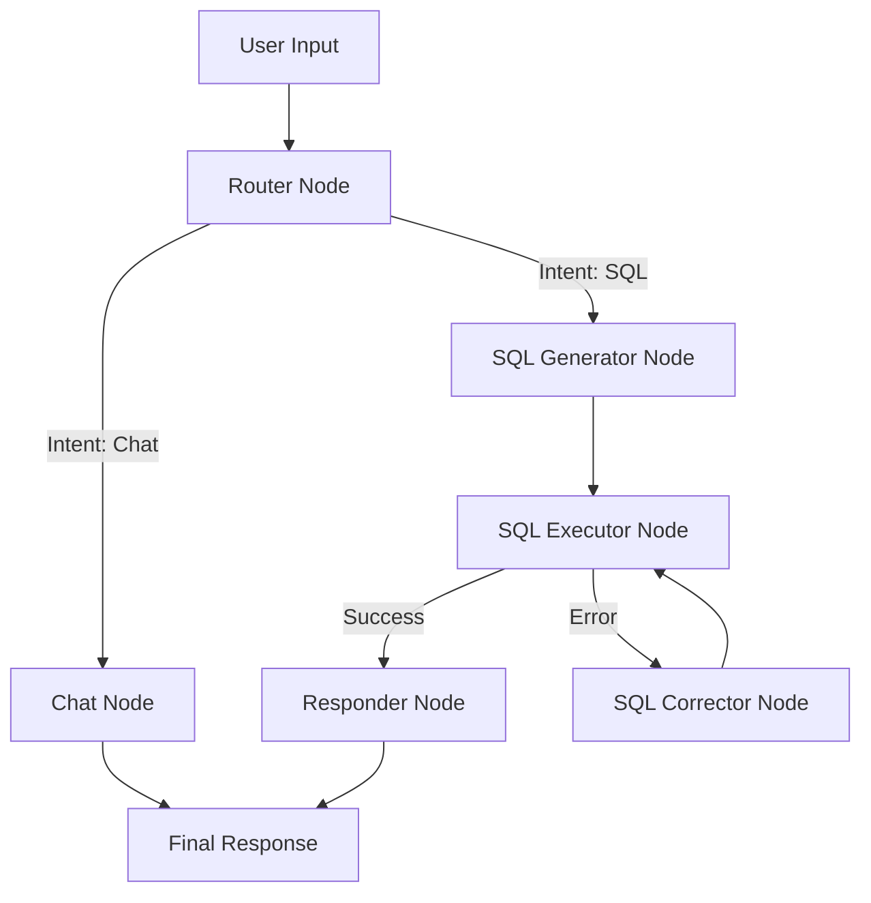

# Inventory Chatbot (SQL)

A professional AI conversational agent that translates natural language into structured SQL queries to manage and query an enterprise relational database.

## 🏗️ System Architecture

### 1. Terminal Interaction Flow

The chatbot operates as a state-machine based conversational agent. It receives natural language input, parses intent, generates SQL, executes it, and converts results back into human-readable reports.



### 2. Core Features

- **Intent Recognition**: Distinguishes between database queries and general chitchat.
- **Self-Correction**: Automatically detects and fixes SQL syntax errors or execution failures before responding.
- **Business Logic**: Automatically filters for **Active** records and excludes **Disposed/Retired** assets by default.
- **SQLite Engine**: Optimized for SQLite3 with specialized date and filtering rules.

## 🚀 Setup & Installation

### 1. Prerequisites

- Python 3.10+
- **Ollama** (for local Mistral) or **OpenAI API Key**.

### 2. Environment Setup

1. Create and activate a virtual environment:
   ```powershell
   python -m venv venv
   .\venv\Scripts\Activate.ps1
   ```
2. Install dependencies:
   ```powershell
   pip install -r requirements.txt
   ```

### 3. Database Initialization

Initialize and seed the local SQLite database from the provided schema and sample data:

```powershell
python setup_database.py
```

### 4. Configuration (.env)

Create a `.env` file in the root directory:

```env
# PROVIDER: 'ollama' or 'openai'
PROVIDER=ollama
MODEL_NAME=mistral
```

## 🏃 Running the Application (CLI)

To launch the interactive terminal chatbot:

```powershell
python main.py
```

## 🛠️ Project Structure

- `main.py`: **Primary Entry Point** for terminal-based interaction.
- `agent/`: Core logic (Graph, Nodes, Prompts, State).
- `architecture.md`: Visual architecture diagrams (Mermaid).
- `inventory_chatbot.db`: Local SQLite database.
- `setup_database.py`: Database initialization script.
