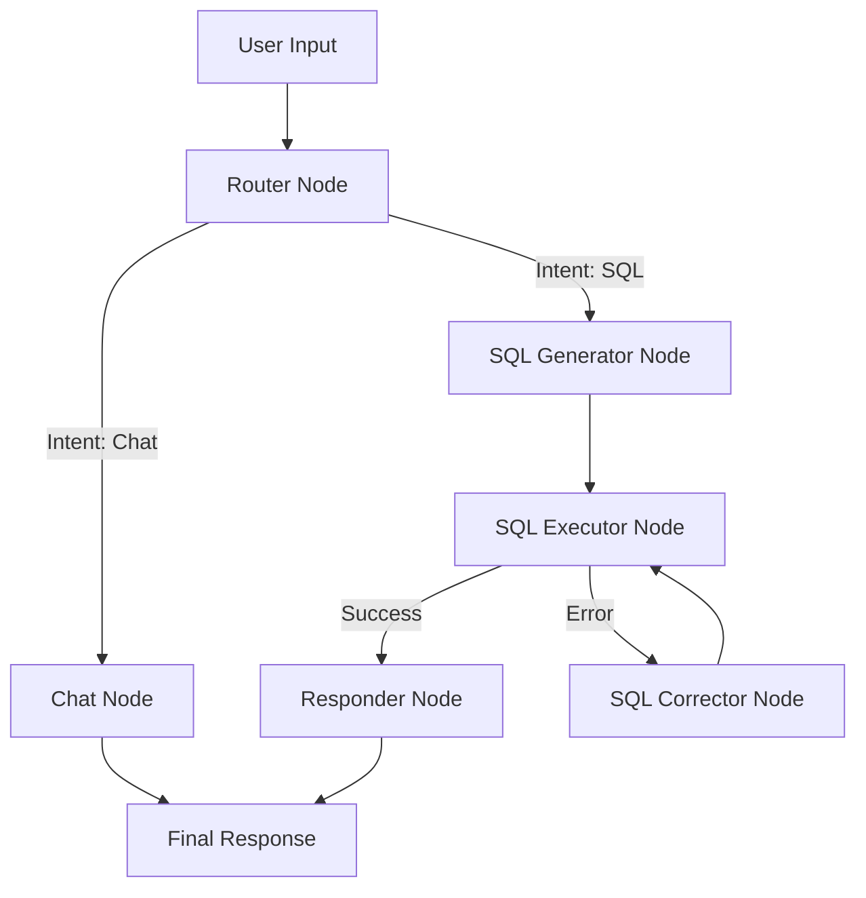

# Architecture Diagrams

## Inventory Chatbot (SQL) - System Flow



## Inventory Chatbot (SQL) - Data Architecture

- **Engine**: LangGraph (State Machine)
- **Database**: SQLite3
- **LLM**: Mistral (via Ollama) / OpenAI
- **Filtering Logic**:
  - Default: `IsActive = 1` for dimension tables.
  - Default: Exclude `Status IN ('Disposed', 'Retired')` for Assets.

```

```
