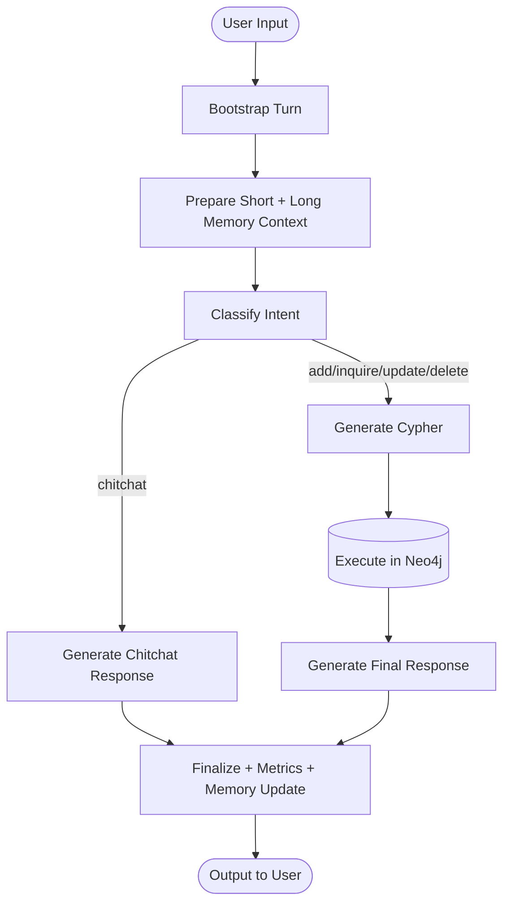

# Neo4j AI Chatbot Flow (LangGraph)

This document describes the current LangGraph-based interaction flow for the Champions League Football Knowledge Graph Chatbot.

## Application Flow

Each user turn is processed as a state graph with routing, checkpointed short-term memory, and persistent long-term memory:

## Flow Breakdown

1. User input is accepted from CLI or Streamlit and sent to the LangGraph orchestrator.
2. A rolling short-memory window is loaded from checkpoint state for the current thread.
3. Relevant long-memory entries are retrieved from persistent SQLite storage.
4. Short and long memory are merged into the prompt context.
5. Intent is classified into add/inquire/update/delete/chitchat.
6. Chitchat requests are answered directly by the response engine.
7. Data requests generate safe Cypher, execute against Neo4j, and produce a natural-language reply.
8. Finalization records latency and turn metrics, then writes the latest turn to both short and long memory.

## Observability

- Logging is centralized and written to console + rotating log file.
- Optional LangSmith tracing captures graph and tool execution when enabled via `.env`.
