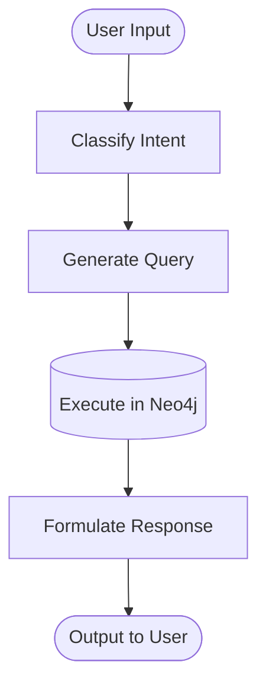

# Neo4j AI Chatbot Flow

This document details the straightforward interaction flow of the Champions League Football Knowledge Graph Chatbot.

## Application Flow

When a user interacts with the chatbot, their request is processed sequentially through 5 simple steps:

### Flow Breakdown

1. **User Input** (`main.py`): The user types a message or question in the terminal.
2. **Classify Intent** (`classifier.py`): The AI categorizes the message into one of five actions: Add, Inquire, Update, Delete, or Chitchat.
3. **Generate Query** (`cypher_generator.py`): The AI translates the user's intent and request into a safe Cypher connection query.
4. **Execute Query** (`executor.py`): The application connects to the Neo4j database, executes the generated query, and returns the raw graph results.
5. **Formulate Response** (`response_engine.py`): The AI takes the raw database results and transforms them into a friendly, human-readable sentence.

This linear sequence ensures predictability and speed.
